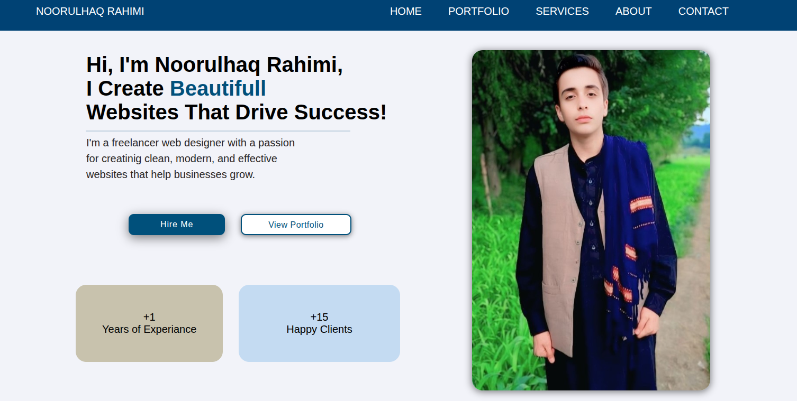

# portfolio website

A modern, clean, and responsive Login Page built with **HTML** and **Tailwind CSS**.



## ✨ Features

- 🎨 Clean and modern UI
- 📱 Fully Responsive Design
- ⚡ Built with HTML & Tailwind CSS
- 🔒 Simple Login Form
- 💻 Easy to customize
- 🚀 Lightweight and fast

## 🛠️ Technologies Used

- HTML5
- Tailwind CSS

## 📂 Installation

1. Clone the repository:

```bash
https://github.com/noorulhaqrahimi/firstNoorulhaqRahimiWebsite.git
```

2. Open the project folder.

3. Open `index.html` in your browser.

## 📸 Preview

Add a screenshot of your project and save it as:

```
nr.png
```

inside the root of your project.

## 📄 License

This project is open source.

✅ You are free to use, modify, and distribute this project anywhere without any cost.

---

Made with ❤️ by **Noorulhaq Rahimi**
